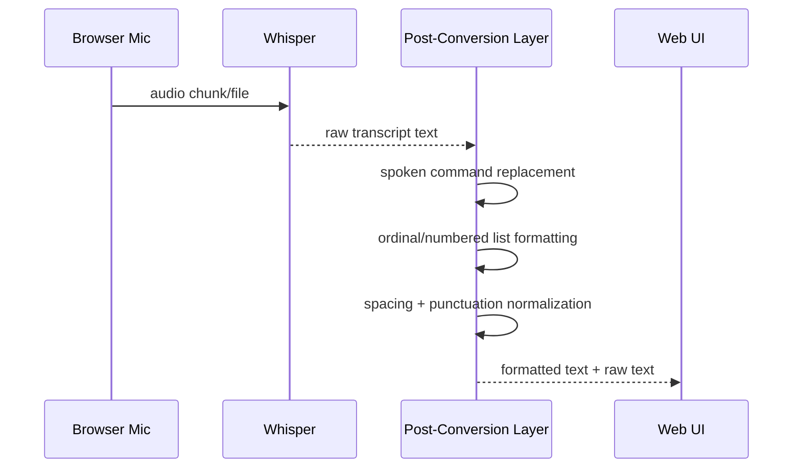
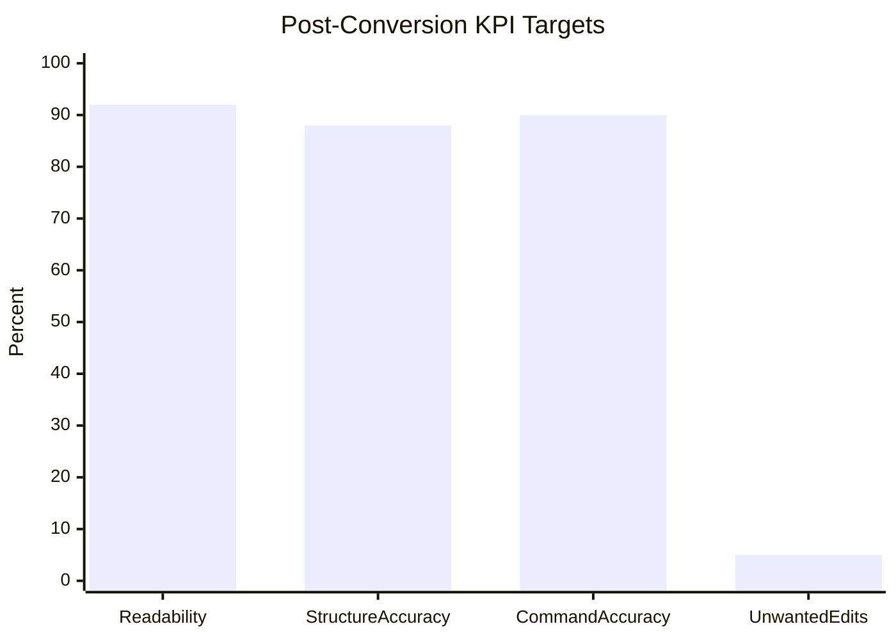

# Post-Conversion Layer (PM Brief)

## Goal
The post-conversion layer transforms raw ASR text from Whisper into polished, readable output that behaves closer to dictation products like Wispr Flow.

## Why This Layer Exists
Raw ASR is usually accurate at words but weak on structure and punctuation. This layer improves UX by:
- converting spoken commands into writing symbols
- formatting steps/lists
- normalizing punctuation and spacing
- preserving readability in multi-line output

## Scope in MVP
### In scope
- Spoken punctuation conversion (`comma`, `period`, `question mark`, etc.)
- Structural commands (`new paragraph`, `new line`, `bullet point`)
- Numbered list cues (`step 1`, `point 2`, `number 3`)
- Ordinal list conversion (`first ... second ... third ...`)
- Basic sentence capitalization and spacing cleanup

### Out of scope (future)
- Domain-aware formatting (emails, code, medical notes)
- Named-entity casing correction (brands, proper nouns)
- Grammar rewriting with a secondary LLM
- User-level custom command macros

## High-Level Flow


## Sequence Diagram


## Pipeline Breakdown
1. Command Parser
- Converts command words into symbols/newlines.
- Example: `new paragraph` -> blank line, `comma` -> `,`.

2. List Detector
- Detects explicit numeric cues and sequential ordinal phrases.
- Converts into canonical numbered list form.

3. Structural Normalizer
- Cleans spacing around punctuation.
- Normalizes list prefixes (`-`, `1.`).
- Reduces excessive blank lines.

4. Casing and Readability Pass
- Capitalizes sentence starts.
- Ensures final punctuation for single-line plain text.

## Example Conversions
### Input (raw)
`there are four steps for this process first one is a second one is b third one is c and fourth one is d`

### Output (formatted)
```text
There are four steps for this process:
1. A
2. B
3. C
4. D
```

### Input (raw)
`new paragraph agenda bullet point launch plan bullet point hiring plan`

### Output (formatted)
```text
Agenda

- Launch plan
- Hiring plan
```

## Error and Edge-Case Strategy
- If list detection is uncertain, keep text linear (do not over-format).
- If numbering is inconsistent, renumber contiguous numbered blocks.
- If commands are absent, apply only light punctuation/casing cleanup.
- Never drop user words; transformations should be reversible from `raw_text`.

## Quality Guardrails
- Deterministic transformations only (same input -> same output).
- Low-latency regex and string pipeline (no second model call in MVP).
- Return both `raw_text` and formatted `text` for transparency and debugging.

## KPI Proposal (MVP)


Interpretation:
- Readability >= 92%
- Structure accuracy >= 88%
- Spoken command accuracy >= 90%
- Unwanted edits <= 5%

## Rollout Plan
1. Phase 1: Ship deterministic formatter with telemetry logs disabled by default.
2. Phase 2: Add opt-in evaluation set and score each formatter stage.
3. Phase 3: Add profile-specific formatting presets (meeting notes, email, chat).

## Risks and Mitigations
- Risk: over-formatting a normal sentence as a list.
  - Mitigation: require sequence confidence (>=2 contiguous ordinal cues).
- Risk: spoken punctuation words that are part of real content.
  - Mitigation: command gating and confidence heuristics in future phase.
- Risk: language variance and accents.
  - Mitigation: language-specific command dictionary in future phase.

## Current Implementation Map
- Entry point: `format_transcript(...)`
- API route integration: `/transcribe` returns both `raw_text` and `text`
- Source file: `web_mvp/app.py`
